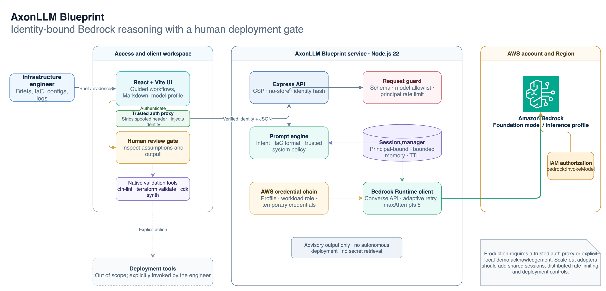
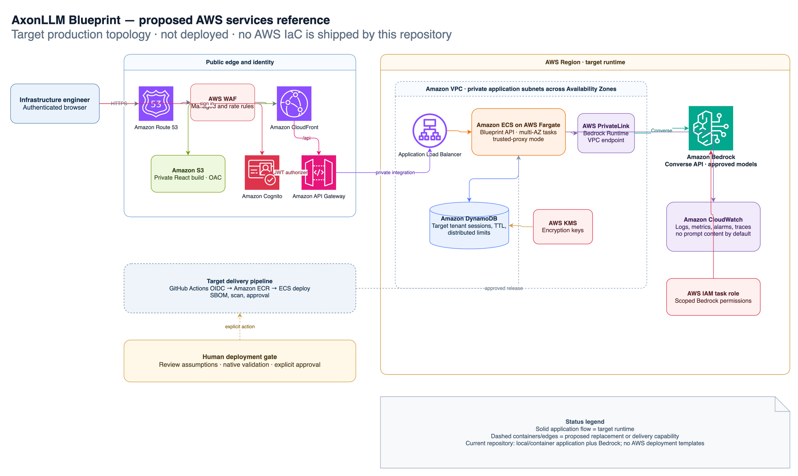

# Architecture

AxonLLM Blueprint is a two-tier TypeScript application:

- a React and Vite browser workspace
- an Express API that invokes Amazon Bedrock through the AWS SDK for JavaScript v3

The editable source is [`assets/axonllm-blueprint-architecture.drawio`](assets/axonllm-blueprint-architecture.drawio).

## AWS services reference architecture

The editable source is
[`assets/axonllm-blueprint-aws-services-reference.drawio`](assets/axonllm-blueprint-aws-services-reference.drawio).
It is a proposed production target, not evidence of deployed infrastructure.
The repository currently ships no AWS IaC. The target maps the documented gaps
to CloudFront and private S3 delivery, Cognito and API Gateway identity,
ECS/Fargate runtime, DynamoDB shared state, private Bedrock connectivity,
CloudWatch observability, and an explicitly approved delivery pipeline.

## Published static mode

Vite mode `public` renders the canonical React product with hash routes for the
overview, synthetic workbench, and interactive architecture. Its API adapter is
deterministic and browser-local. The normal build still uses `/api` and retains
the production startup guard and trusted-proxy boundary.

## Request flow

1. A trusted proxy authenticates production requests and injects a verified identity header.
2. The API hashes that identity, binds sessions to it, and applies a per-principal model-call limit.
3. The browser creates an in-memory session through the API.
4. A request includes the message, selected server-allowlisted model, and bounded inference parameters.
5. The API validates type, size, model, and parameter constraints.
6. The prompt engine classifies the task as architecture guidance, IaC generation, configuration review, or troubleshooting.
7. Bounded conversation history is assembled with a trusted system prompt.
8. The Bedrock Runtime client calls the Converse API using the standard AWS credential chain.
9. The response and token usage return to the browser as Markdown.
10. The engineer reviews the output and runs native validation before any separate deployment action.

## Backend components

### Request guard

The API caps JSON request size, trims and limits messages, validates finite inference values, rejects unknown configuration keys, allows only model IDs configured on the server, and applies a bounded in-process model-call limiter.

### Identity boundary

Production startup requires either trusted-proxy mode or an explicit unauthenticated acknowledgement. Trusted-proxy mode rejects requests without the configured verified identity header. Blueprint hashes the identity and uses the digest for session ownership and rate-limit keys.

### Prompt engine

User-provided logs and configuration remain in the user message. They are never interpolated into the system prompt. The system policy prevents claims of deployment, secret retrieval, and unverified validation.

### Session manager

Sessions are process-local and bounded by:

- 500 active sessions
- 24 messages per session
- four-hour inactivity expiry
- principal ownership

This is intentional for a reference beta. It is not durable or suitable for horizontal scaling.

### Bedrock client

The SDK client uses:

- `ConverseCommand`
- explicit `maxTokens`
- adaptive retry mode
- five maximum attempts
- the default AWS credential provider chain

Service errors are translated into stable HTTP status codes without returning raw SDK details to the browser.

## Trust boundaries

- The browser is untrusted.
- The authentication proxy is trusted to strip spoofed identity headers and inject a verified identity.
- User messages, logs, and configuration are untrusted data.
- Model IDs are trusted only after server allowlist validation.
- AWS credentials remain on the server or workload runtime.
- Model output is untrusted advisory content until human review and native validation.
- Deployment tooling is outside the application boundary.

## Extension points

Production adopters can replace the session manager with a durable store, replace the in-process limiter with a distributed limiter, integrate their identity provider at the trusted proxy, instrument model calls, or add approved retrieval sources. These changes should preserve the server model allowlist and human deployment gate.
